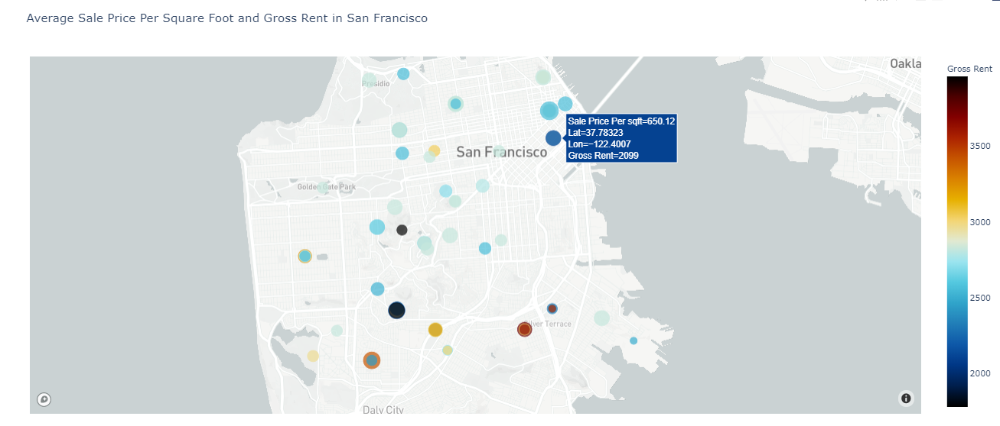
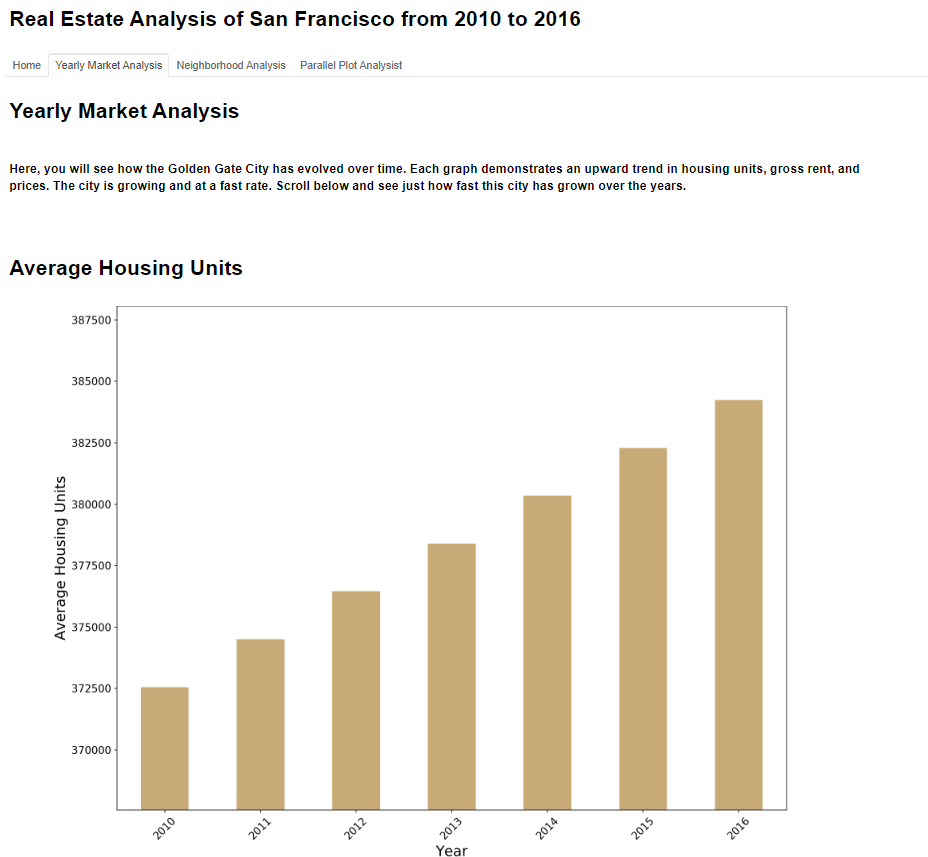
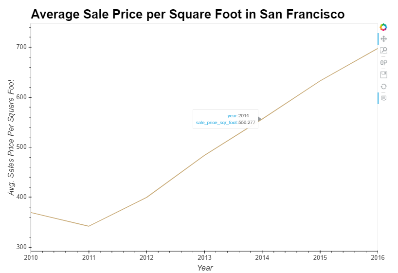
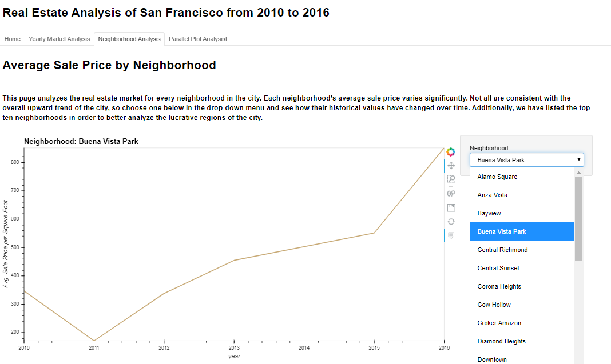
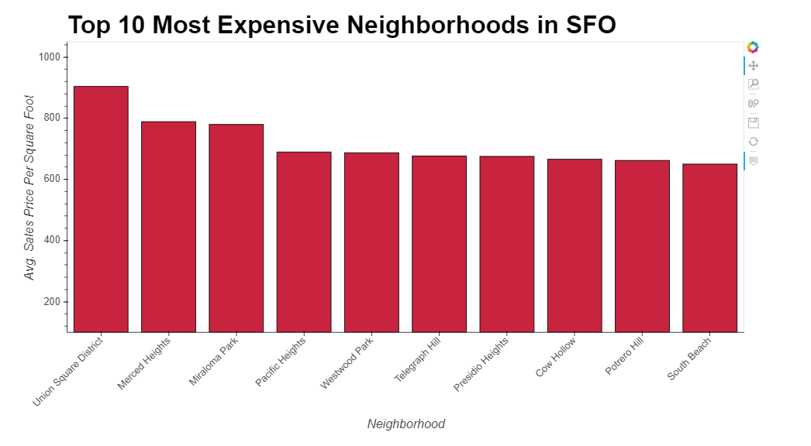
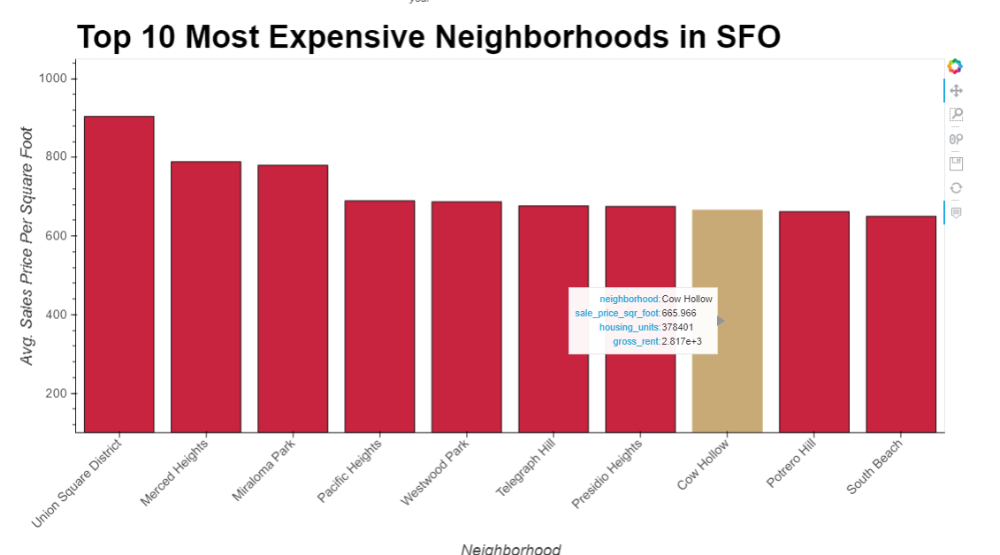
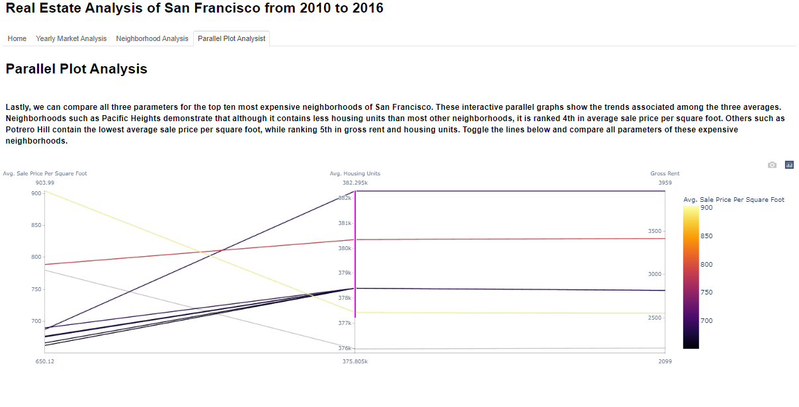
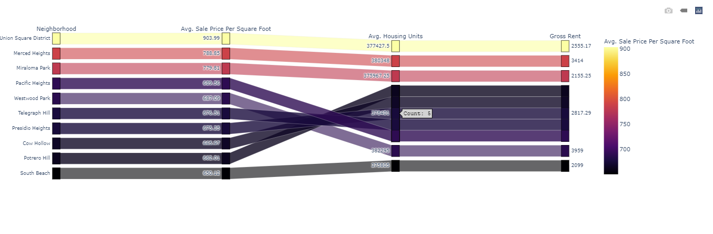

# Real Estate Analysis of San Francisco from 2010 to 2016
This dashboard showcases various investment opportunities for the San Fransisco Real Estate market. The goal was to build an interactive dashboard using a series of charts, maps, and features that help customers explore the data and fascilitate their decision to invest in rental properties of San Francisco. 

## **Overview of Dashboard Features**
This section demonstrates the overall dashboard functionality with transitions between each tab and some of the interactive features among the visuals. 

---

* ## Geographic Housing Analysis (First Tab) 

---

* ## Yearly Market Analysis (second Tab) 

 

 

---

* ## Neighborhood Analysis (Third Tab) 

 

 

---

* ## Parallel Plots (Fourth Tab) 

 

