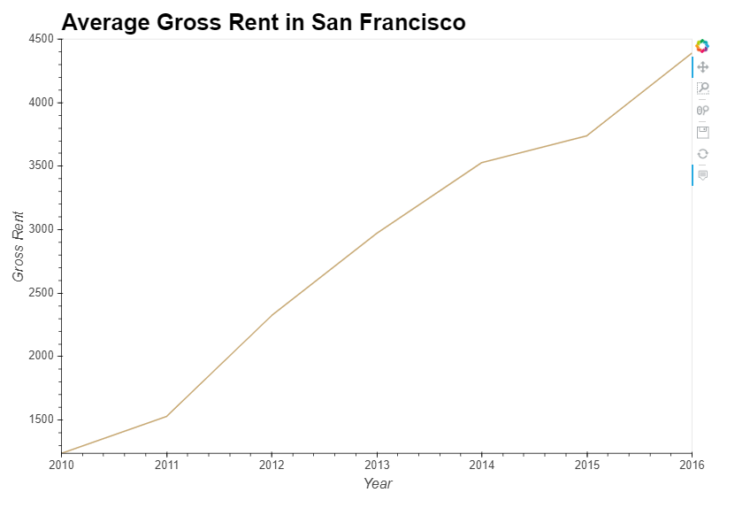

# Real Estate Analysis of San Francisco from 2010 to 2016

## Overview 

**Hover your mouse on the data points to get more information about the neighborhoods**

## Yearly Market Analysis (second Tab)

**scroll down**

**scroll down**

## Neighborhood Analysis (Third Tab)

**scroll down**

**Hover over the bars to get more info about the top ten neighborhoods.**

## Parallel Plots (Fourth Tab)

**scroll down**

